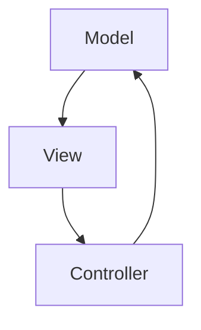

Flappy - Rapport de projet
===
*projet pcii 2023*


[TOC]

## Introduction

Ce projet consiste à réaliser un mini-jeu inspiré du célèbre jeu mobile *Flappy Bird* dans lequel un objet (ici un ovale) se déplace le long d'une ligne brisée qui défile.
Le joueur doit régulièrement cliquer sur l'écran pour faire "sauter" l'ovale et le maintenir sur cette ligne.

L'interface graphique est de cette forme :


*la partie s'arrête lorsque l'ovale sort de la ligne brisée*


Analyse globale
---

Pour ce faire, il faut trois fonctionnalités principales : 
- l'interface graphique avec l'ovale et la ligne brisée (présentée ci-dessus)
- le défilement automatique de la ligne brisée
- la réaction de l’ovale aux clics de l’utilisateur


On commencera par traitement de ces deux sous-fonctionnalités : 
- création d'une fenêtre et dessin de l'ovale
- déplacement vers le haut de l'ovale lors d'un clic

Tout en organisant l'interface graphique selon le modèle MVC

Ensuite, il faut modifier les éléments de l'affichage (chute de l'ovale, génération / défilement de la ligne) de façon indépendante. L'usage de threads permettra d'implémenter : 
- chute de l'ovale
- construction du parcours (la ligne brisée)
- défilement de la ligne brisée
- affichage du score 

Enfin, pour terminer le jeu : 
- ajout d'éléments de décors (oiseaux) ! 
- détection des collisions (fin de partie)
- arrêt des autres fonctions (vol, défilement du parcours...)
- affichage d'un message de fin de partie


Plan de développement
---

**Séance 1 :**
- Liste des tâches : 
    * A : Analyse du problème *20min*
    * B : Conception, développement et test d’un fenêtre avec un ovale *30min*
    * C : Conception, développement et test du mécanisme de déplacement de l’ovale + gestion des clic souris *45min*
    * D : Acquisition de compétences en Swing *55min*
    * E : Documentation du projet *60min*


**Séance 2 :**
- Liste des tâches : 
    * A : Conception, développement et test du thread permettant la chute de l'ovale *40min*
    * B : Génération d'une ligne brisée *40min*
    * C : Défilement de la ligne brisée *60min*
    * D : Ajustement fenêtre et affichage score *20min*
    * E : Documentation du projet *60min*


**Séance 3 :**

- Liste des tâches : 
    * A : Détection collisions *60min*
    * B : Défaite (arrêt threads, fenêtre) *30min*
    * C : Ajout d'éléments de décors (Classe oiseau, vueOiseau , génération oiseaux) *60min*
    * D : Résolution des pb de synchronisation : création d'un thread d'affichage *45min*
    * E : Documentation du projet *60min*


Conception générale
---
L'interface graphique est structurée en trois parties selon le motif MVC (Modèle, Vue, Contrôleur) : 



- Modèle : la classe `Model.java` définit l’ensemble des données qui caractérisent l’état de l'interface (constantes/variables importantes) et des méthodes qui modifient le modèle.
- Vue : la classe `View.java` contient ce qui est relatif à l'affichage : gère la façon dont l’état du modèle est rendu visible à l’utilisateur
- Contrôleur : la classe `Controller.java` gère les modifications de l'état du modèle (il s'agit du traitement des interactions utilisateur,gestion des évènements...). C'est le lien entre l'interface et le reste du monde. Il communique avec les deux classes précédentes (pour modifier le modèle et mettre à jour l'affichage.

trois packages ont été créés pour regrouper les classes correspondantes 


Par exemple : 
L'implémentation de la première fonctionnalité (création d’une fenêtre et dessin de l’ovale) est réalisée dans `View.java`.

Pour la seconde fonctionnalité (déplacement vers le haut de l’ovale lors d’un clic), les méthodes et variables de modification de position (saut) ont été intégrées à `Model.java`. Les méthodes relatives à la gestion d'évènements (détéction du clic) sont dans `Controller.java`.

Les fonctions de vol, et de génération du parcours sont dans des classes héritant de thread. (détails ci-dessous)...


Conception détaillée
---

Diagramme de classes complet : 


- Conception, développement et test d’un fenêtre avec un ovale : 
    La fenêtre est réalisée avec l'API `java.swing` dans la     classe `View.java` qui est une hérite de l'objet JPanel     qui est le composant graphique de base de la               bibliothèque. L'ovale est dessiné avec la fonction de dessin de la bibliothèque.
    Par la suite, les constantes (taille fenêtre etc) ont       été déplacées dans la classe Etat.
- Conception, développement et test du mécanisme de déplacement de l’ovale + gestion des clic souris : 
On a créé la classe `Controller.java` qui hérite d'un `Listener` de la classe `java.awt.event` qu'on ajoute à la fenêtre que l'on vient de créer pour détecter les clic souris. Dans la méthode concernée , il a suffi de déclencher un mouvement vertical de l'ovale.
- Chute de l'ovale : 
L'ovale doit chuter en permanence, cela ne peut pas se faire dans le même thread de l'interface car il serait bloqué par la boucle de chute...
Il a fallu implémenter une nouvelle classe qui hérite d'un thread : `Fly.java` construite à partir du modèle qui permet aux deux threads de tourner simultanément.
- Construction d'une ligne brisée : 
C'est une nouvelle classe `Path.java` qui a pour attribut principal une liste de points qui la représente. Ces points sont générés aléatoirement(bibliothèque rand.). Pour que la pente soit raisonnable, une marge de 1/6 de la hauteur fenêtre a été fixée en ordonnée aux extrémités de l'écran et une distance minimale en abscisse.
- Défilement de la ligne brisée : 
C'est dans le thread `Avancer.java` : un compteur `position` que l'on incrémente fait avancer la position de quelques pixels avec un paramètre sleep entre chaque pas qui permet de déterminer la vitesse de défilement (constante ``allspeed``). Ici il faut générer un point de plus que ce qui est affiché pour avoir une ligne continue au fur et à mesure du défilement. C'est fait dans le thread (ainsi que la suppression des points devenus obseletes).
L'objet Avancer est donc construit à partir d'un `chemin`, d'une `vue` et un `modèle`.
- Détection collisions : algorithme

```
// l'ovale se situe sur la ligne entre les points précédent(x1,y1) et suivant(x2,y2) :

x : position en abscisse de l'ovale (centre de l'ovale)
formule mathématique :         pente   * 
        hauteurLigne = (y2-y1)/(x2-x1) * (x-x1)+y1

```
C'est donc en récupérent les coordonnées relatives des points suivants et précédents puis en appliquant ce calcul que l'on peut connaître la hauteur de la ligne.

```
collision <=> hauteurLigne >= haut de l'ovale OU hauteur ligne <= bas de l'ovale

```
On peut ensuite déterminer si il y a eu collision.
Ceci est codé dans une fonction testPerdu qui est appelée à chaque saut ou chute.


- Défaite : Un booléen GameOver est initialisé à false dans `etat`. La valeur false de ce booléen est une condition d'éxécution de tous les autres threads. Ceci permet d'interrompre les autres thread en cas de défaite. En cas de défaite, la fonction `testPerdu` affiche une fenêtre avec le score de la partie.

- Ajout d'éléments de décors (Classe oiseau, vueOiseau , génération oiseaux) : Une classe `Bird.java` construit l'objet correspondans.
l'oiseau animé est un *gif* décomposé en 8 images png qui sont affichés alternativement à chaque dessin de l'oiseau dans le thread `BirdView.java`
Cette classe contient également une fonction generateBird() qui ajoute aléatoirement un oiseau à l'affichage pour avoir des oiseaux qui défilent sur l'écran.

- Résolution des pb de synchronisation : création d'un thread d'affichage `Repaint` permettant de rafraîchir l'affichage qui contient une methode publique permettant aux autres thread de prévenir lors des modifications du modèle. Le cas échéant, l'affichage est toujours mis à jour 25 fois par seconde. Ceci permet de fluidifier l'affichage et d'optimiser le programme. En effet, ceci a permis de remplacer les appels multiples à view.repaint dans les autres classe qui entrainaient une surcharge de l'affichage


Résultat
---

Cf. copie d'écran intro

Documentation utilisateur
---
* Prérequis : Java avec un IDE (ou Java tout seul si vous avez fait un export en .jar exécutable)
* Mode d’emploi : Importez le projet dans votre IDE, sélectionnez la classe Main à la racine du projet puis « Run as Java Application ». Cliquez sur la fenêtre pour faire monter l’ovale.


Documentation développeur
---

La classe main est située dans le dossier src.
Les autres classes sont réparties dans les 3 packages décrits dans la rubrique Conception générale.
Les constantes du modèle sont décrites dans la classe `Model.java` et sont décrites en commentaire.
La classe Vue contient les fonctions d'affichages. 
Une améliorations intéressante est l'ajout d'un menu par une nouvelle classe dans`View`. On pourrait ajuster la vitesse ou d'autres variables de `etat` directement ou même ajouter des options commme recommencer une partie en ajoutant un bouton sur la fenêtre Joptionpane affiché en fin de partie.

Conclusion et perspectives
---
En conclusion, ce mini-projet était plutôt instructif. J'ai pu remarquer l'importance de la documentation et de la mise en commentaires de mon code. Même si ce n'est pas un projet de groupe, cela m'a aidé à organiser mon code, à le débogguer et à m'y replonger plus facilement à la prochaine séance. Il permet également de s'initier à l'utilisation des threads et de comprendre les aspects de la synchronisation. J'ai eu des idées d'amélioration mais j'ai manqué de temps : une amélioration l'interface graphique en ajoutant un paysage en arrière-plan. J'aurais également implémenté un système qui permet de recommencer une partie après une défaite...  Ce projet m'a aidé à développer de nouvelles compétences utiles pour le projet de groupe à venir.


